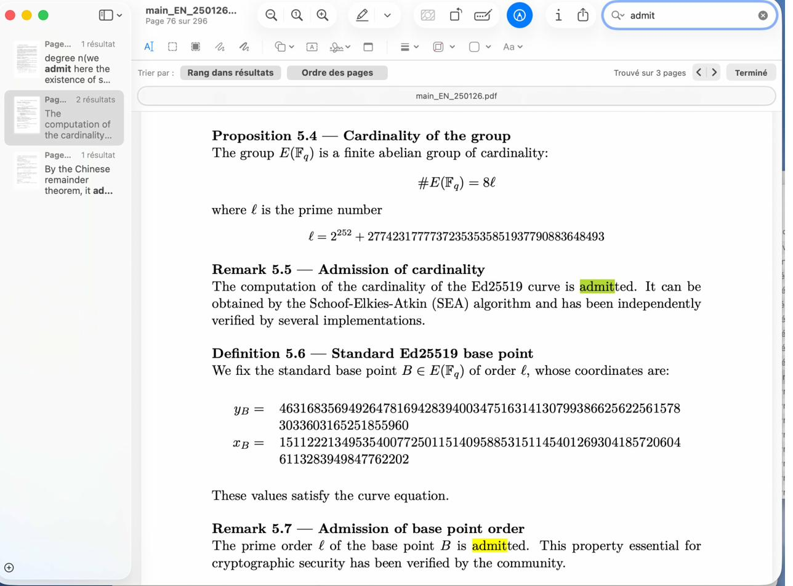

# Ed25519 Verification from First Principles

[](https://github.com/philipperackette/ed25519-curve-verification/actions/workflows/ci.yml)


**A standalone C++17 program that independently proves the correctness of every Ed25519 elliptic curve parameter — from primality of the field modulus to the exact group order via Schoof's algorithm.**

No GMP. No OpenSSL. No external dependencies. One file, ~1500 lines, pure arithmetic.

---

## Motivation

Most implementations of Ed25519 treat the curve parameters as trusted constants inherited from [RFC 8032](https://datatracker.ietf.org/doc/html/rfc8032). The field prime, the generator coordinates, the subgroup order, the cofactor — all are typically copied from a specification without independent verification.

This program takes a different approach. It reconstructs the entire argument from scratch: it proves `p` is prime, computes the base point from its defining equation, verifies the subgroup order algebraically, and runs Schoof's algorithm on the equivalent Weierstrass model to recover the exact group cardinality.

The result is a fully self-contained computational proof that the Ed25519 parameters are exactly what they claim to be.

### From the book to the code

In my book [*Quorum Cryptography on Tails OS*](https://www.amazon.fr/dp/B0GLGC8GWP), I develop a complete k-of-n threshold vault system built on elliptic curve cryptography. At one point (Proposition 5.4), the group order of Ed25519 is **admitted** — stated without proof, as is common in applied cryptography texts:

> *"The computation of the cardinality of the Ed25519 curve is admitted. It can be obtained by the Schoof–Elkies–Atkin (SEA) algorithm and has been independently verified by several implementations."*

This repository closes that gap. What the book admits, this code proves.

<p align="center">
  
</p>

---

## Scope

This repository is **not** a production Ed25519 signing library.

It is a standalone mathematical verification program whose purpose is to:
- verify the Ed25519 field and curve parameters,
- prove the subgroup order of the standard base point,
- compute the full curve order independently via Schoof's algorithm.

If you want a production cryptographic implementation, use a well-audited solution appropriate to your operating environment and threat model.
If you want an independently readable mathematical verification of the curve parameters, this repository is for that purpose.

## What this program verifies

The verification proceeds in eight steps, each building on the previous ones.

**Step 1 — Field prime.**
The program verifies that `p = 2^255 - 19` is prime using a deterministic Miller-Rabin test with 20 bases. This establishes the finite field F_p over which all subsequent arithmetic takes place.

**Step 2 — Curve parameter d.**
The twisted Edwards parameter `d = -121665 / 121666 mod p` is computed and verified to be a quadratic non-residue. This guarantees that the addition law on the Edwards curve is complete (no exceptional cases).

**Step 3 — Base point.**
The standard generator B is computed from its defining y-coordinate `y = 4/5 mod p`. The x-coordinate is recovered by solving the curve equation, and the point is verified to lie on the curve.

**Step 4 — Subgroup order.**
The claimed prime order `l` is verified by two independent checks:
- `[l]B = O` (the neutral element), computed via double-and-add scalar multiplication.
- `l` is prime (Miller-Rabin), so by Lagrange's theorem, `ord(B) = l`.

**Step 5 — Curve model equivalence.**
The base point is converted through three curve models: twisted Edwards → Montgomery (Curve25519) → short Weierstrass. Each conversion is verified by checking that the point satisfies the target curve equation, and a full round-trip confirms the birational maps are consistent.

**Step 6 — Cofactor structure.**
Points of order 2, 4, and 8 are exhibited explicitly on the Edwards curve, proving the cofactor is exactly `h = 8`.

**Step 7 — Schoof's algorithm.**
The total group order `#E(F_p)` is computed from scratch using Schoof's algorithm on the Weierstrass model. This is the computationally intensive step: for each small prime `l`, the algorithm determines the Frobenius trace `t mod l` by working in the polynomial quotient ring `F_p[x] / (psi_l)`, where `psi_l` is the l-th division polynomial. The Chinese Remainder Theorem then recovers the full trace, and the group order follows from Hasse's formula.

**Step 8 — Final comparison.**
The computed group order is compared against the expected value `8 * l`. Agreement confirms the complete parameter set.

---

## Verified result

The full verification was executed on a miniPC (AMD Ryzen 3 3250U, 6 GB RAM, Linux Mint 22.3) over approximately 54 hours. Schoof's algorithm processed 27 primes until the CRT product exceeded the Hasse bound.

```
  Schoof: 193828.9s  primes used: 27
  trace |t| = -221938542218978828286815502327069187962
  #E = 57896044618658097711785492504343953926856930875039260848015607506283634007912

  #E == expected: YES
  #E == 8·l: YES (cofactor h=8)
```

The complete execution log, system information, and SHA-256 hashes are available in the [`verifications/`](verifications/) directory. The hash manifest is signed with my PGP key (fingerprint `BC69 21A8 5B8D DBB5 F3A6 EB81 9055 4E6A 6924 F3C7`).

---

## Quick start

```bash
g++ -O2 -std=c++17 -Wall -Wextra -pedantic -o ed25519_verify ed25519_verify.cpp
./ed25519_verify --generator-only
```

- `--generator-only`: fast sanity verification (seconds)
- no argument: full verification including Schoof (hours to tens of hours)
- `--schoof-only`: Schoof stage only
- `--small-test`: brute-force tests on small curves

## Build and run

Compile with any C++17 compiler:

```bash
g++ -O2 -std=c++17 -Wall -Wextra -pedantic -o ed25519_verify ed25519_verify.cpp
```

Run modes:

```bash
./ed25519_verify                   # Full verification including Schoof (hours)
./ed25519_verify --generator-only  # Steps 1-6 only (seconds)
./ed25519_verify --schoof-only     # Schoof computation only (hours)
./ed25519_verify --small-test      # Brute-force tests on small curves
```

The `--generator-only` mode completes in under a second and verifies everything except the group order computation. The full run with Schoof is a serious computation — expect tens of hours on commodity hardware without multi-precision library optimizations.

---

## Reproducible validation

For independent verification, a script is provided that automates the entire workflow:

```bash
bash run_validation.sh
```

This compiles the source, runs the full verification, and collects all artifacts (build log, execution log, system information, SHA-256 hashes) into a timestamped output directory. The intended workflow is:

1. Run `bash run_validation.sh` on your machine.
2. Review the generated `hashes.txt`.
3. Sign `hashes.txt` with your own PGP key.
4. Publish the output directory as your independent attestation.

---

## Mathematical background

A companion document, [`SCHOOF_EXPLAINED.md`](SCHOOF_EXPLAINED.md), provides a pedagogical walkthrough of Schoof's algorithm: what each computation does, why the algorithm works, and why it is exponentially faster than exhaustive point counting. The exposition defines all notation before use and is intended to be accessible to anyone comfortable with modular arithmetic and polynomial rings.

For a broader treatment of applied elliptic curve cryptography — including threshold signature schemes, operational security on Tails OS, and Python implementations of k-of-n vault protocols — see:

**[Quorum Cryptography on Tails OS: Build a k-of-n Vault with Proofs and Python Implementation](https://www.amazon.fr/dp/B0GLGC8GWP)**
*Philippe Rackette — Available on Amazon*

---

## Repository structure

```
ed25519_verify.cpp          Source code (single file, zero dependencies)
run_validation.sh           Automated build-run-hash script
SCHOOF_EXPLAINED.md         Pedagogical companion on Schoof's algorithm
LICENSE                     MIT license

verifications/
  README.md                 Index of independent validation runs

  linux-x86_64-minipc-2026-03/
    verification.log        Complete execution output
    system_info.txt         Hardware, OS, compiler details
    build.log               Compilation output
    hashes.txt              SHA-256 checksums of all artifacts
    hashes.txt.asc          PGP signature over hashes.txt

  macos-arm64-m1-2026-03/
    verification.log        Complete execution output
    system_info.txt         Hardware, OS, compiler details
    build.log               Compilation output
    hashes.txt              SHA-256 checksums of all artifacts
    hashes.txt.asc          PGP signature over hashes.txt

pgp/
  philipperackette.asc      Author's PGP public key

doc/
  book_admits_order.png     Book excerpt showing the admitted result
```

---

## Author

**Philippe Rackette**

Researcher in applied cryptography. Author of [*Quorum Cryptography on Tails OS*](https://www.amazon.fr/dp/B0GLGC8GWP), a hands-on guide to building mathematically proven threshold vault systems.

This repository reflects the same philosophy as the book: cryptographic confidence should be earned through explicit computation, not inherited through trust.

PGP: `BC69 21A8 5B8D DBB5 F3A6 EB81 9055 4E6A 6924 F3C7`

---

## License

MIT. See [LICENSE](LICENSE).
